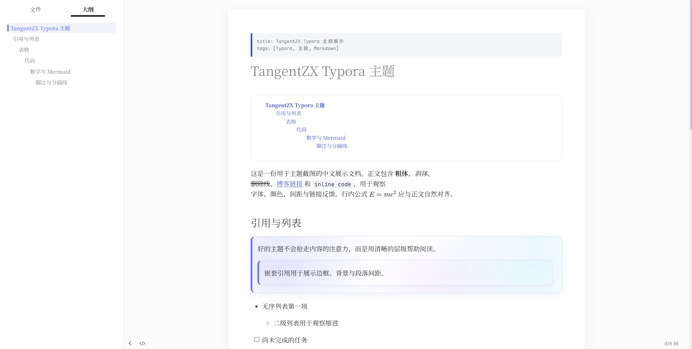
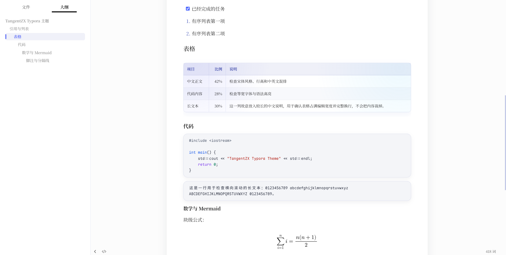
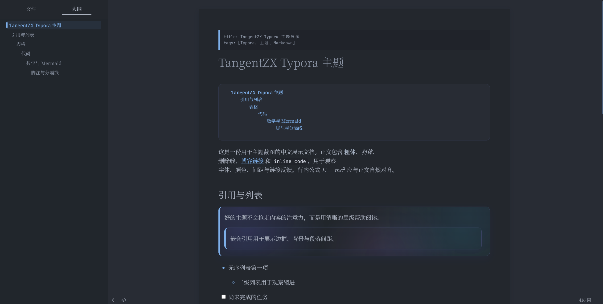
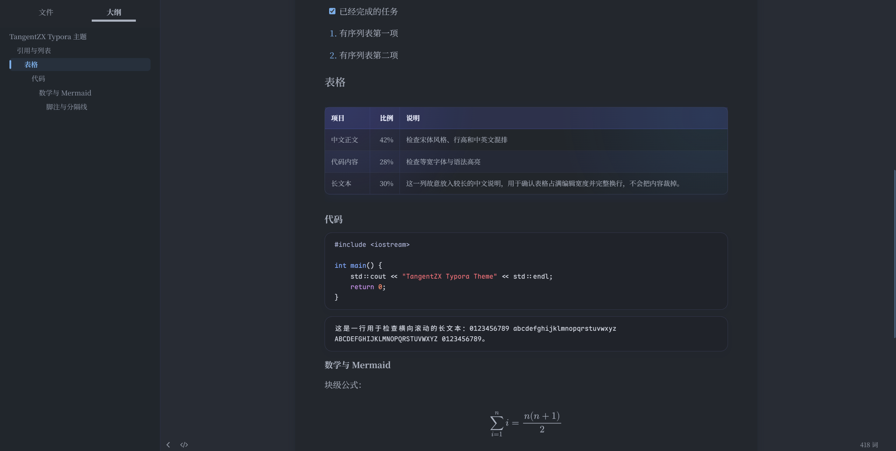

# TangentZX Typora Theme

一款从 [TangentZX 博客文章页](https://tangentzx.com/) 提炼而来的 Typora
主题，优先适配 Windows，同时提供独立的浅色和深色版本。主题保留 Typora
原生文件树与大纲，不额外添加侧栏。

## 主题特点

- 蓝紫色强调色、轻渐变、圆角与克制的阴影；
- 完整适配正文、标题、引用、列表、表格、公式和脚注；
- 针对 CodeMirror 代码块、源码模式和 Mermaid 分别调整配色；
- 适配文件树、大纲、搜索框、专注模式、打字机模式和 PDF 导出；
- 两个根目录 CSS 都是独立文件，离线使用且没有外部样式依赖。

## 效果展示











## 推荐字体

为了获得与设计一致的中文排版，建议安装：

- 正文：[Noto Serif SC](https://github.com/notofonts/noto-cjk/releases)
- 代码与源码模式：[Maple Mono CN](https://github.com/subframe7536/maple-font/releases)

主题不会联网下载或捆绑字体。未安装时，正文会依次回退到 Georgia、
Times New Roman 和系统衬线字体；代码会回退到 Maple Mono、Cascadia Code、
Consolas 和系统等宽字体。

## Windows 安装

1. 在 Typora 中打开“文件 → 偏好设置 → 外观”。
2. 点击“打开主题文件夹”。
3. 从仓库根目录下载主题。安装时只需复制 `tangentzx-light.css` 或
   `tangentzx-dark.css` 中你要使用的一个；希望菜单中同时出现两个主题时才下载两个。
4. 将选中的 CSS 直接放入主题文件夹，不需要复制 `src/`、`scripts/` 或 `tests/`。
5. 完全退出并重启 Typora，再从“主题”菜单选择对应主题。

## 更新

关闭 Typora，用新版本的同名 CSS 覆盖主题文件夹中的旧文件，然后重新启动。

## 卸载

关闭 Typora，从主题文件夹删除已安装的 `tangentzx-light.css` 和/或
`tangentzx-dark.css`，然后重新启动。

## 使用展示文档截图

1. 安装推荐字体并打开 `showcase.md`。
2. 展开 Typora 左侧文件树或大纲，使用较宽的编辑窗口。
3. 分别选择浅色、深色主题，截取相同内容区域。
4. 将图片保存为 `screenshots/light.png` 和 `screenshots/dark.png`。
5. 删除“效果展示”中对应图片外层的 HTML 注释标记。

## 开发与验证

用户安装时不需要这一节中的文件。主题源码位于 `src/`，根目录 CSS 由
PowerShell 脚本确定性生成：

```powershell
powershell -NoProfile -ExecutionPolicy Bypass -File .\scripts\build.ps1
```

运行完整契约：

```powershell
& .\tests\theme-contract.tests.ps1
```

## 常见问题

- **主题菜单中没有出现主题**：确认文件扩展名是 `.css` 而不是 `.css.txt`，
  且文件直接位于 Typora 打开的主题文件夹中。
- **更新后仍显示旧样式**：先切换到其他主题再切回来；仍无效时完全退出并重启 Typora。
- **字体效果不同**：确认 Windows 字体设置中能找到 `Noto Serif SC` 和
  `Maple Mono CN`。
- **PDF 颜色与编辑器不同**：重新启动 Typora 后再导出，主题会保留当前浅色或
  深色配色，并隐藏编辑器导航。

## 边界说明

本主题只修改外观，不注入 JavaScript，不修改 Typora 程序文件或授权状态，
也不会创建第二个侧栏。
