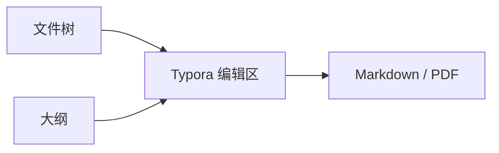

# TangentZX Typora 主题

[toc]

这是一份用于主题截图的中文展示文档。正文包含 **粗体**、*斜体*、
~~删除线~~、[博客链接](https://tangentzx.com/) 和 `inline code`，用于观察
字体、颜色、间距与链接反馈。行内公式 $E = mc^2$ 应与正文自然对齐。

## 引用与列表

> 好的主题不会抢走内容的注意力，而是用清晰的层级帮助阅读。
>
> > 嵌套引用用于展示边框、背景与段落间距。

- 无序列表第一项
  - 二级列表用于观察缩进
- [ ] 尚未完成的任务
- [x] 已经完成的任务

1. 有序列表第一项
2. 有序列表第二项

### 表格

| 项目 | 比例 | 说明 |
| --- | ---: | --- |
| 中文正文 | 42% | 检查宋体风格、行高和中英文混排 |
| 代码内容 | 28% | 检查等宽字体与语法高亮 |
| 长文本 | 30% | 这一列故意放入较长的中文说明，用于确认表格占满编辑宽度并完整换行，不会把内容裁掉。 |

#### 代码

```cpp
#include <iostream>

int main() {
    std::cout << "TangentZX Typora Theme" << std::endl;
    return 0;
}
```

```text
这是一行用于检查横向滚动的长文本：0123456789 abcdefghijklmnopqrstuvwxyz ABCDEFGHIJKLMNOPQRSTUVWXYZ 0123456789。
```

##### 数学与 Mermaid

块级公式：

$$
\sum_{i=1}^{n} i = \frac{n(n+1)}{2}
$$



###### 脚注与分隔线

主题展示到这里结束，脚注用于观察较小字号与链接颜色。[^1]

[^1]: TangentZX Typora Theme 同时提供独立的浅色和深色 CSS。

---

最后一段用于检查文档末尾的留白、背景与滚动位置。
